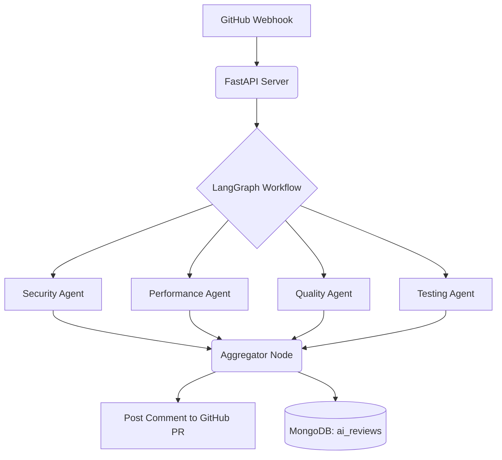

# CodeSage AI: Multi-Agent GitHub Code Review Platform

CodeSage AI is an advanced, fully automated code review platform built using **FastAPI**, **LangGraph**, and **Google Gemini**.

Instead of relying on a single prompt to review your code, CodeSage AI orchestrates **4 independent AI Agents** that run in parallel using asynchronous workflows. It catches webhooks directly from GitHub, analyzes your Pull Requests, aggregates the findings, and posts a beautifully formatted review back onto your GitHub PR—all within seconds.

## 🚀 Features

- **GitHub Native Webhooks**: Automatically listens to PR `opened` and `synchronize` events.
- **Deep Code Extraction**: Uses the GitHub API to fetch the exact file diffs/patches for a given Pull Request.
- **LangGraph Orchestration**: Executes a complex, stateful multi-agent workflow.
- **Parallel AI Processing (Gemini)**:
  - 🔒 **Security Agent**: Hunts for SQL injection, XSS, and hardcoded secrets.
  - ⚡ **Performance Agent**: Detects N+1 queries, blocking I/O, and O(N^2) loops.
  - 🧹 **Quality Agent**: Enforces clean code principles, DRY, and naming conventions.
  - 🧪 **Testing Agent**: Flags missing edge cases and unhandled exceptions.
- **Automated Aggregation**: Merges the findings from all 4 agents and ranks them by severity (Critical -> Low).
- **GitHub Commenting**: Posts the final Markdown report as a direct comment on your GitHub Pull Request.
- **Headless API Persistence**: Saves all AI reviews into MongoDB, providing REST APIs (`/api/v1/reviews/{owner}/{repo}`) to fetch historical data.

---

## 🛠️ Architecture

CodeSage AI uses a highly concurrent backend architecture. When a PR is opened, the payload flows through the following pipeline:



Because the 4 agents run in **parallel** via `asyncio`, the entire review process takes exactly the same amount of time as running a single LLM prompt, ensuring ultra-fast feedback for developers.

---

## 💻 Tech Stack

- **Backend Framework**: [FastAPI](https://fastapi.tiangolo.com/) (Python)
- **AI Orchestration**: [LangGraph](https://python.langchain.com/v0.1/docs/langgraph/) & LangChain Core
- **LLM Provider**: [Google Gemini](https://ai.google.dev/) (gemini-2.5-flash)
- **Database**: [MongoDB](https://www.mongodb.com/) via [Motor](https://motor.readthedocs.io/en/stable/) (Async I/O driver)
- **HTTP Client**: [HTTPX](https://www.python-httpx.org/) (for async GitHub API calls)

---

## ⚙️ Setup & Installation

### 1. Prerequisites
- Python 3.10+
- MongoDB running locally (default: `mongodb://localhost:27017`)
- A [Google Gemini API Key](https://aistudio.google.com/app/apikey)
- A GitHub Personal Access Token (with `repo` access)

### 2. Install Dependencies
```bash
cd backend
python -m venv venv
source venv/bin/activate  # On Windows: venv\Scripts\activate
pip install -r requirements.txt
```

### 3. Environment Variables
Create a `.env` file in the `backend/` directory:
```env
MONGODB_URI=mongodb://localhost:27017
MONGODB_DB_NAME=codesage_db
GITHUB_TOKEN=your_github_personal_access_token
GEMINI_API_KEY=your_gemini_api_key
GITHUB_WEBHOOK_SECRET=your_optional_webhook_secret
```

### 4. Run the Server
```bash
uvicorn app.main:app --reload
```
The server will start at `http://localhost:8000`.

---

## 🪝 Connecting to GitHub

Since the backend is deployed (e.g., on Render), you can connect it directly to any GitHub repository without needing tools like ngrok!

1. Go to your GitHub Repository -> **Settings** -> **Webhooks** -> **Add webhook**.
2. **Payload URL**: `https://<your-render-url>.onrender.com/api/v1/webhooks/github`
3. **Content type**: `application/json`
4. **Events**: Select "Let me select individual events" and check **Pull requests**.

Now, open a Pull Request in that repository containing messy code, and watch CodeSage AI review it in seconds!

---

## 🔌 API Endpoints

Even though this acts as a GitHub Bot, it provides full REST APIs to query the generated data:

- `GET /health` - System health check.
- `GET /api/v1/reviews/{owner}/{repo}` - Get all AI reviews for a specific repository.
- `GET /api/v1/reviews/{owner}/{repo}/{pr_number}` - Get the AI review for a specific PR.
- `POST /api/v1/webhooks/github` - The webhook receiver (used by GitHub).
